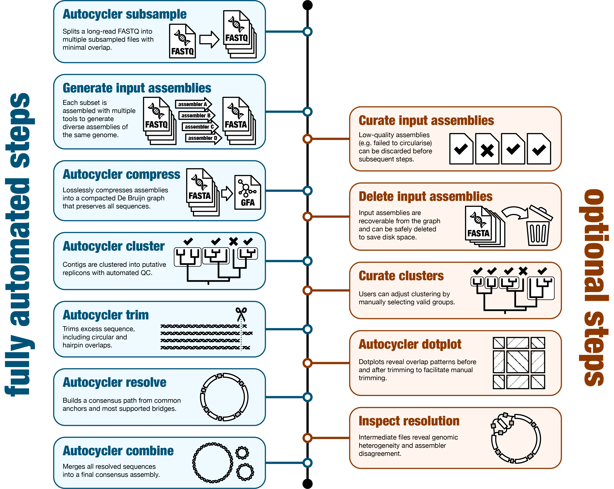
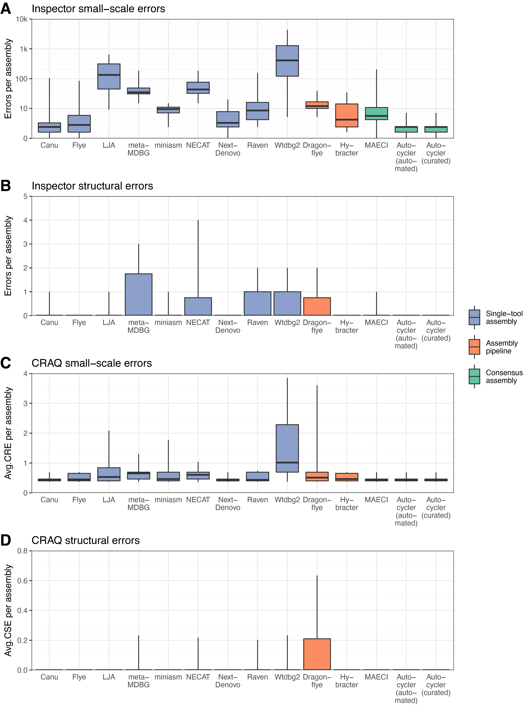

**Figure 1:** Overview of the Autocycler workflow. By following only the blue steps on the left, Autocycler can produce consensus genome assemblies with no human intervention. The optional orange steps on the right can be used when accuracy is critical or when Autocycler's metrics (gathered using the `autocycler table` command) indicate potential issues.

    

**Figure 2:** Assembler benchmarking results from the `assess_assembly.py` script. **(A)** Sequence errors (substitutions and indels); **(B)** Sequence errors and structural assembly errors (missing and extra bases). Lower values on the y-axes indicate better assembly accuracy. Results are coloured by category: individual long-read assembly tools (blue), long-read assembly pipelines (orange) and consensus assembly tools (green). Autocycler results are shown separately for fully automated and manually curated assemblies. Boxplot whiskers extend to the minimum and maximum values. The y-axes use a pseudo-logarithmic scale that accommodates zeros.

    

**Figure S1:** Assembler benchmarking results from [Inspector](github.com/Maggi-Chen/Inspector) and [CRAQ](https://github.com/JiaoLaboratory/CRAQ). **(A)** Total small-scale errors per assembly from Inspector; **(B)** Structural errors per assembly from Inspector; **(C)** Clip-based Regional Errors (CRE) per assembly from CRAQ; **(D)** Clip-based Structural Errors (CSE) per assembly from CRAQ. Lower values on the y-axes indicate better assembly accuracy. Results are coloured by category: individual long-read assembly tools (blue), long-read assembly pipelines (orange) and consensus assembly tools (green). Autocycler results are shown separately for fully automated and manually curated assemblies. Boxplot whiskers extend to the minimum and maximum values.
